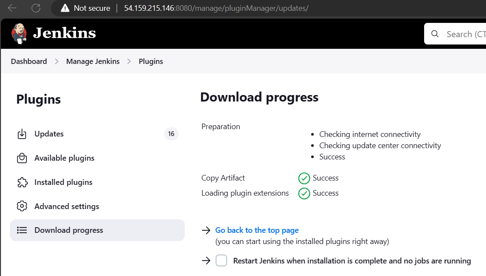

# Ansible Refactoring & Static Assignments (Imports and Roles)

## In this project I will continue working with ansible-config-mgt repository and make some improvements of your code. Now I need to refactor my Ansible code, create assignments, and learn how to use the imports functionality. Imports allow to effectively re-use previously created playbooks in a new playbook - it allows me to organize my tasks and reuse them when needed.

### Code Refactoring

#### Refactoring is a general term in computer programming. It means making changes to the source code without changing expected behaviour of the software. The main idea of refactoring is to enhance code readability, increase maintainability and extensibility, reduce complexity, add proper comments without affecting the logic.

#### In my case, I will move things around a little bit in the code, but the overal state of the infrastructure remains the same.

#### Let us see how I can improve my Ansible code!

## Step 1 - Jenkins job enhancement

### Before we begin, let us make some changes to our Jenkins job - now every new change in the codes creates a separate directory which is not very convenient when we want to run some commands from one place. Besides, it consumes space on Jenkins serves with each subsequent change. Let us enhance it by introducing a new Jenkins project/job - we will require Copy Artifact plugin.

1. Go to your Jenkins-Ansible server and create a new directory called ansible-config-artifact - we will store there all artifacts after each build.

`sudo mkdir /home/ubuntu/ansible-config-artifact`

2. Change permissions to this directory, so Jenkins could save files there

`chmod -R 0777 /home/ubuntu/ansible-config-artifact`

3. Go to Jenkins web console -> Manage Jenkins -> Manage Plugins -> on Available tab search for Copy Artifact and install this plugin without restarting Jenkins

4. Create a new Freestyle project (you have done it in Project 9) and name it save_artifacts.

5. This project will be triggered by completion of your existing ansible project. Configure it accordingly: